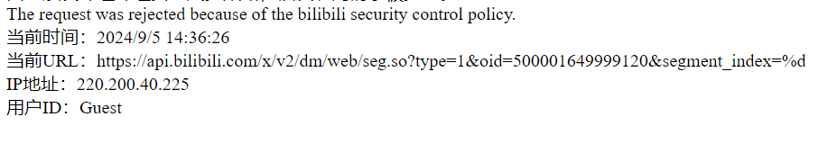
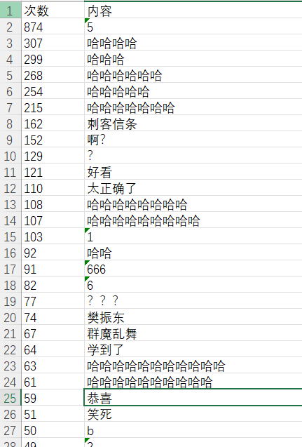
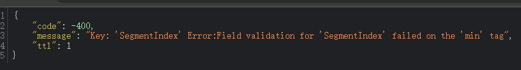

# 一、PSP表格

| **PSP2.1**                              | **Personal Software Process Stages**    | **预估耗时（小时）** | **实际耗时（小时）** |
| :-------------------------------------- | --------------------------------------- | -------------------- | -------------------- |
| Planning                                | 计划                                    |                      |                      |
| · Estimate                              | · 估计这个任务需要多少时间              | 20                   | 22                   |
| Development                             | 开发                                    |                      |                      |
| · Analysis                              | · 需求分析 (包括学习新技术)             | 3                    | 2                    |
| · Design Spec                           | · 生成设计文档                          | 1                    | 1                    |
| · Design Review                         | · 设计复审                              | 1                    | 1                    |
| · Coding Standard                       | · 代码规范 (为目前的开发制定合适的规范) | 1                    | 1                    |
| · Design                                | · 具体设计                              | 1                    | 1                    |
| · Coding                                | · 具体编码                              | 5                    | 8                    |
| · Code Review                           | · 代码复审                              | 1                    | 2                    |
| · Test                                  | · 测试（自我测试，修改代码，提交修改）  | 2                    | 4                    |
| Reporting                               | 报告                                    |                      |                      |
| · Test Repor                            | · 测试报告                              | 1                    | 1                    |
| · Size Measurement                      | · 计算工作量                            | 0                    | 0                    |
| · Postmortem & Process Improvement Plan | · 事后总结, 并提出过程改进计划          | 1                    | 1                    |
|                                         | · 合计                                  | 17                   | 22                   |

# 二、任务要求的实现

## 项目设计与技术栈

开始之前拆分为了三个环节

1. 获取视频url
2. 通过url获取弹幕
3. 排序并存储

但事实上在具体的去做了之后，发现还有一个环节。 需要先通过url获取cid，通过cid再获取弹幕。

所以事实上是四个环节

1. 获取视频url
2. 通过url获取cid
3. 通过cid获取弹幕
4. 排序并存储

技术栈

- 正则，jsoup，抓包工具，一些库

### 获取视频url

在b站主页进行搜索时，利用抓包工具找到响应页面的主要请求，也就是返回大量视频信息的那个请求。记录下搜索的url，然后第二页，记录下搜索的url。找到规律即可。

找到搜索的url之后，按F12打开开发者工具，寻找视频链接所在的位置，接着就是找规律，然后使用jsoup获取dom，再获取attr，再遍历，就获取了所有的视频url了。

### 通过url获取cid

其实跟上一个步骤差不多，唯一不同的就是我获取cid使用的是正则表达式。

### 通过cid获取弹幕

跟前面还是一样的，着重说一下编程思路吧。

发送请求获取响应之后，利用写好的正则表达式进行匹配，对符合要求的结果写到map中，并不断进行合并，统计弹幕的次数。代码里很清晰，而且有很详细的注释。

### 排序并存储

一开始是自己手写了一个双向链表排序的，后来写着写着bug不断，就突然想起来还有小顶堆这个东西，所以直接自己写了接口，调用方法了，然后就把数据全部排好序，接着找到操作excel的包，使用即可。

## 爬虫与数据处理

类有如下几个

- Cid
- Comment
- Const
- Excel
- KV
- Utils
- VideoURLScraper
- Main

这些类通过名字以及前面的介绍都能知道什么功能，就不多说了，简单以获取Comment的方法`findComment`进行介绍吧，其他的与他都是共通的，只有一些逻辑和请求头的不同。（代码部分见源码）

在`findComment`中，一开始先利用传进来的**Cid**创建一个**URL**然后尝试通过这个**URL**来获取源数据，设置请求的方法`GET`然后设置一些请求头以免发生麻烦(缺失`Accept`的请求实际上会丢失一些数据)。然后发送请求并校验是否成功，如果不成功那就直接退出了(事实上还有一个循环用来不断地尝试寻找这个Cid的所有弹幕)，请求获取成功之后就接受他，并创建以一个`Pattern`对象来准备匹配正则表达式，创建好后把刚刚的数据转换成字符串类型传进去，然后匹配并存储即可。

## 数据统计接口部分的性能改进

数据统计并不会花费太长的时间，真正的时间开销的大头在正则表达式和网络请求上，而且b站有保护机制，请求过于频繁的ip会遭到封禁，一段时间后才会解封,我就被封禁了两次。

程序中开销最大的就是正则部分，甚至都不需要性能测试工具，因为其他部分的开销几乎没有。

## 数据结论的可靠性

我在控制url数量的情况下，包括我在小规模的测试时，通过植入一些日志语句，获取了一些视频的详细信息，然后对着这些信息和最后输出的excel表对比得出结论，我的代码是可靠的。

事实上你只要把Const中的值改为1，也就是只获取第一个热门视频，然后在数据输出之后你也可以自行的去对比。

## 数据可视化界面的展示

我并没有花费太多时间在这里，只是对excel进行了简单的设置，整体看起来一目了然而已

关于词云，事实上排名靠前的大多弹幕都是无意义的，比如

所以我手动的提取了一些没那么次数比较多且相对有含义的词条，创建了一个词云图

# 三、心得体会

1. 之前有写过一些爬虫相关的代码，但我觉得都不及这次的复杂，尤其是想要获取弹幕要发送三次请求，我觉得是有一点麻烦了，不过数据的处理与获取倒不是很难。

2.  还有就是关于b站的保护机制，之前有说过ip会被封禁，所以代码中有一些`Thread.sleep()`来降低请求的频率，让整体不那么容易被封禁，如果你在运行我的代码后并没有出现预期结果(一个excel文件)，那你可能需要访问一下[这个网站](https://api.bilibili.com/x/v2/dm/web/seg.so?type=1&oid=500001649999120&segment_index=%d)来看一下你有没有被封禁。如果是这样的那就说明你没事(被封禁是有提示的，像前面的示例一样)，是代码的问题，但我已经在不同的环境下运行过了，大概率是没问题的吧。

3. 最后要说的就是时间的问题，因为300个视频还是比较多的，而且要加入休眠，那就让整体所消耗的时间更多了，我找了一些`User-Agent`来交替使用，并且使用了异步代码，同时会有十个线程工作，而获取300个视频弹幕的时间也从原来的300秒左右变成了50秒，我认为还是不错的。但还是如前面所说，是有概率被封禁ip的，如果你不想被封禁，也不在乎多等一会儿，那就把`Const`类中的`threadCount`改为1

4. 差点忘了还有一个没说的是，由于这个平台的代码同步做的实在是......一言难尽，我没有使用git来控制整体流程，而是写完之后直接上传的，因为我实在找不到什么文档去操作，只好这样了。

   